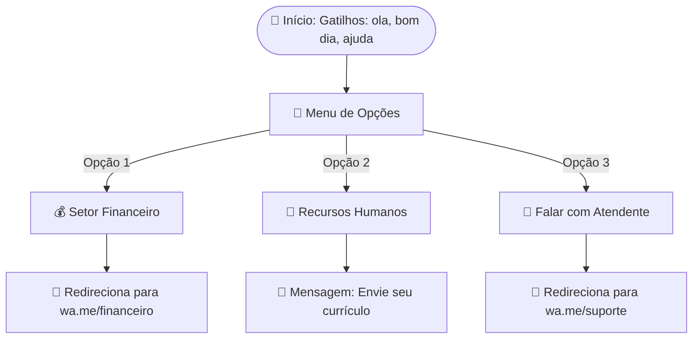
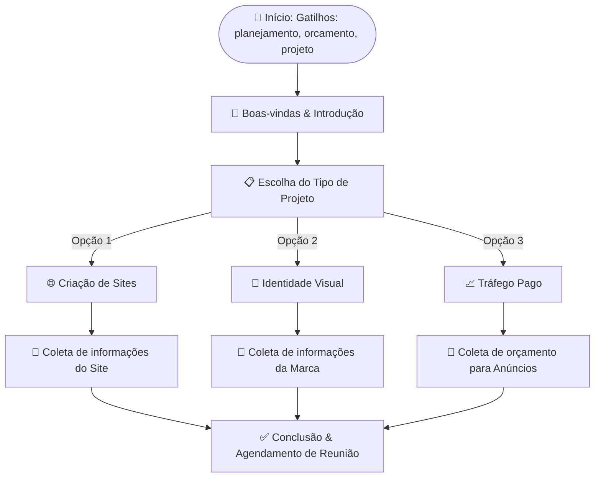

# 🗺️ Exemplos de Fluxos de Atendimento

Este guia apresenta exemplos de fluxos de conversas prontos para servir de inspiração e modelo para o seu chatbot WhatsApp, estruturados para o **Setor Administrativo** e para o **Planejamento de Projetos**.

---

## 🏢 1. Fluxo Administrativo (Triagem & Suporte)

Ideal para organizar a porta de entrada da sua empresa, direcionando o cliente automaticamente para o setor correto (Financeiro, RH ou Atendimento Humano).

### 📊 Diagrama do Fluxo (Mermaid)

### ⚙️ Configuração dos Nós (Nodes):

1. **Nó de Início (Start Node)**:
   * **Gatilhos**: `ola, olá, bom dia, boa tarde, administrativo, ajuda, menu`

2. **Nó de Menu (Menu Node)**:
   * **Texto**: 
     > "Olá! Seja muito bem-vindo ao setor administrativo da nossa empresa. 🏢
     > Para começarmos, por favor selecione uma das opções abaixo digitando o número correspondente:"
   * **Opções**:
     * `1` - Setor Financeiro (Segunda via de boletos, notas fiscais)
     * `2` - Recursos Humanos (Vagas abertas, envio de currículos)
     * `3` - Falar com Atendente (Suporte personalizado)

3. **Opção 1 — Setor Financeiro (Nó de Mensagem + Transferência)**:
   * **Texto**: "Perfeito! Estou te direcionando para o nosso departamento financeiro..."
   * **Nó de Transferência**: Direciona para o telefone `5561999998888` (Financeiro).

4. **Opção 2 — Recursos Humanos (Nó de Mensagem)**:
   * **Texto**: "Excelente! Para participar de nossos processos seletivos, por favor envie o seu currículo em formato PDF diretamente por aqui, ou encaminhe para o e-mail: `vagas@empresa.com.br`."

5. **Opção 3 — Suporte Humano (Nó de Transferência)**:
   * **Texto**: "Entendido. Um de nossos atendentes humanos prosseguirá com o seu suporte..."
   * **Nó de Transferência**: Direciona para o telefone `5561999997777` (Suporte Geral).

---

## 📅 2. Fluxo de Planejamento & Vendas (Qualificação de Leads)

Criado para capturar novos clientes, entender as necessidades de um projeto e colher informações fundamentais para a criação de um orçamento.

### 📊 Diagrama do Fluxo (Mermaid)

### ⚙️ Configuração dos Nós (Nodes):

1. **Nó de Início (Start Node)**:
   * **Gatilhos**: `planejamento, planejar, orcamento, orçamento, projeto, criar site, marca`

2. **Nó de Boas-vindas (Message Node)**:
   * **Texto**: 
     > "Que ótimo que você quer planejar o seu próximo projeto conosco! 🚀
     > Nós somos especialistas em transformar ideias digitais em resultados de alta performance."

3. **Nó de Escolha (Menu Node)**:
   * **Texto**: "Qual é o foco principal do seu planejamento hoje?"
   * **Opções**:
     * `1` - Criação de Sites, Portais ou E-commerce
     * `2` - Criação de Logotipo e Identidade Visual
     * `3` - Marketing Digital e Anúncios Online

4. **Nó de Detalhamento — Sites (Message Node)**:
   * **Texto**: "Legal! Para projetarmos seu site ideal, por favor nos informe: \n1. Qual é o segmento do seu negócio? \n2. Você já possui domínio registrado? \n\nDigite tudo em uma única mensagem para que nossa equipe técnica analise."

5. **Nó de Conclusão (Message Node)**:
   * **Texto**: 
     > "Obrigado por compartilhar esses detalhes! 🙌
     > Acabei de notificar nosso gerente de projetos. Em breve entraremos em contato com uma proposta comercial completa ou agendamento de uma call rápida de 15 minutos."
